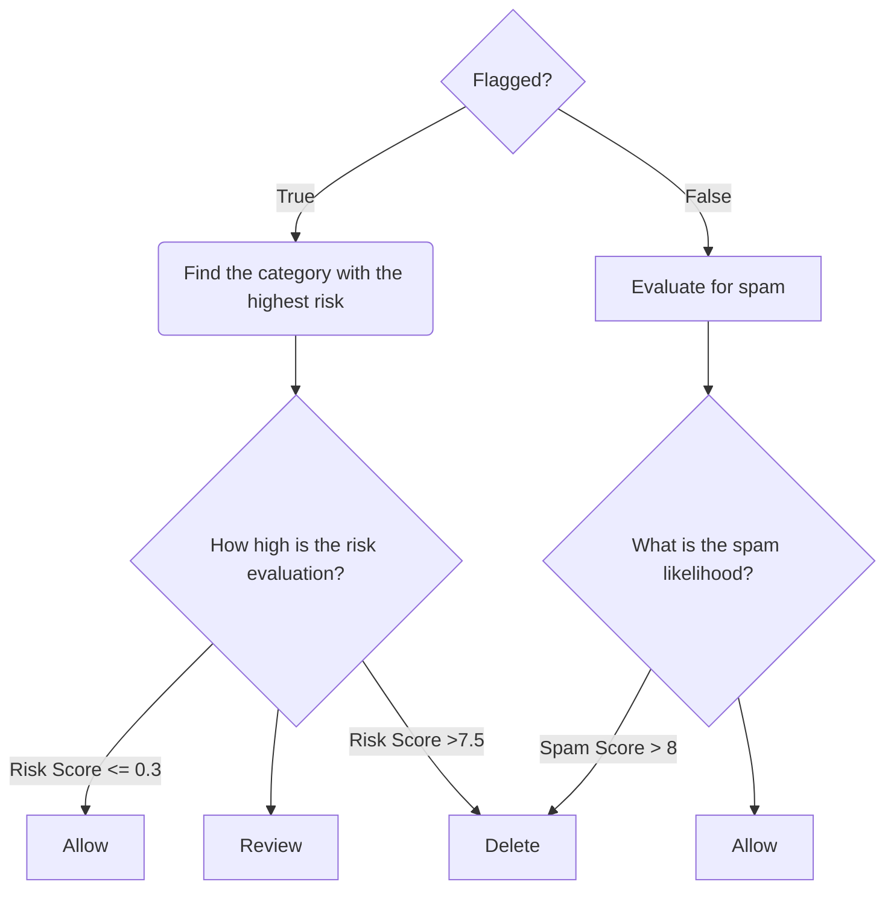
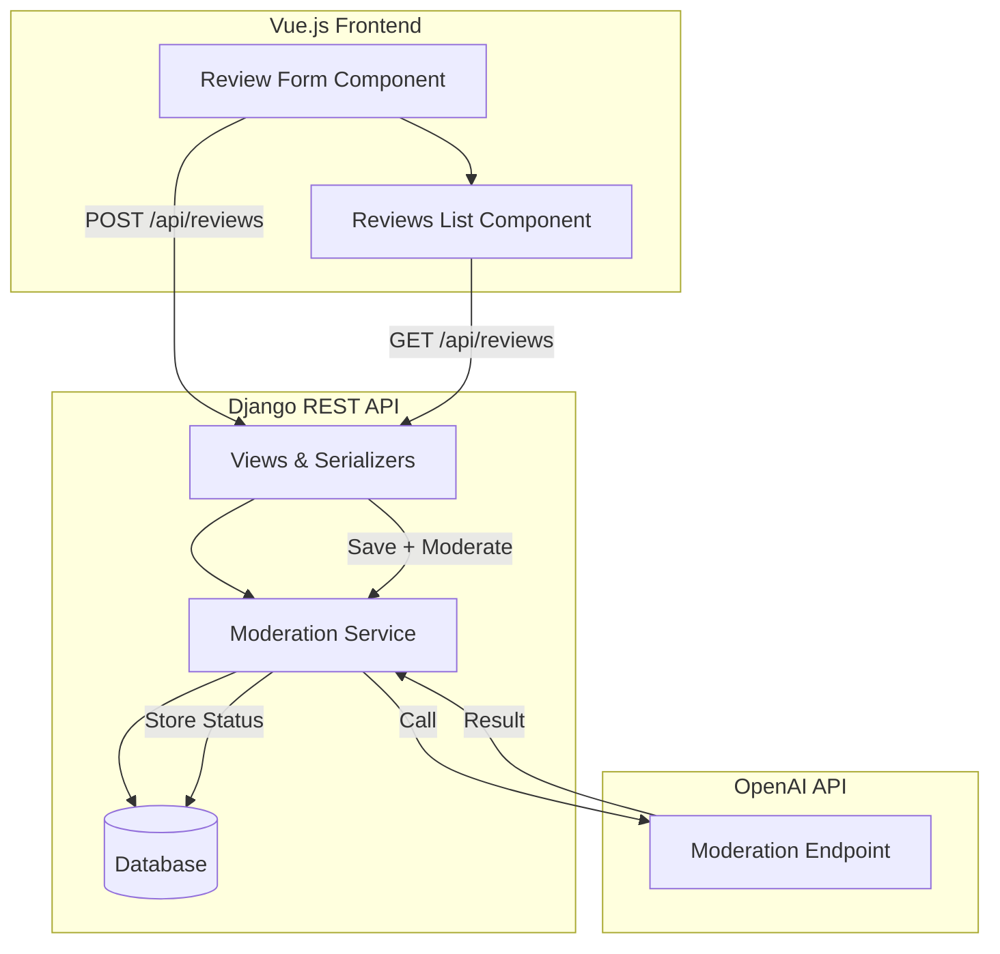

# AI-powered Review Moderation system

This project is a demo of a full-stack application that allows users to submit reviews, which are automatically moderated using OpenAI's moderation endpoint. Reviews are classified into categories such as allowed, pending, or to be deleted, and the frontend displays only approved content. 

Features include:
* Automatic AI moderation of submitted reviews
* RESTful API built with Django REST Framework
* Frontend built using Vue 3
* CSRF & CORS protection for secure client-server communication
* Secure Django Admin panel for viewing all moderation results

## Installation

### Django (Backend)

```bash
cd backend
python -m venv venv
source venv/bin/activate   # Windows: venv\Scripts\activate
pip install -r requirements.txt

# Set the OpenAI API key
export OPENAI_API_KEY="your_api_key_here"

python manage.py migrate
python manage.py createsuperuser
python manage.py runserver

```
Hosted on: http://localhost:8000/

### Vue (Frontend)

```bash
cd frontend
npm install
npm run dev

```
Hosted on: http://localhost:5173/

## Project development

Split development into 3 phases:
1. Models & Services
2. Automatic Review System
3. Vue Frontend

### Phase 1: Models & Services

The first step was to lay down the backend foundation; designing the data model and setting up a modular service layer to handle AI moderation logic. Instead of putting moderation logic directly in the model or views, I utilized the Domain Service Pattern to create created a dedicated service module `moderation_service.py` to interact with OpenAI's Moderation API, keeping the AI integration modular and reusable, making it easy for a future developer to improve upon it.

```txt
backend/
├── services/
│   ├── __init__.py
│   ├── moderation_service.py      # AI moderation logic
├── views.py                       # Use services here
├── models.py                      # Database models

```

The moderation logic works as follows:



### Phase 2: Automatic Review System

Django's `signals.py` was used to automatically trigger moderation logic before a review is saved to the database. Specifically, we used a `pre_save` signal that listens for new Review objects and calls the moderation service before they're written in. 

Django REST Framework allows for URLs to serve JSON data as opposed to templates. Serializers are used to convert complex data like Django models into JSON. 

Then we need to complete the `views.py` and `urls.py` with Django REST Frameworks `ModelViewSet` and a `router` to build a simple RESTful API.

`GET /api/reviews/` → List all allowed reviews
`POST /api/reviews/` → Submit a new review


### Phase 3: Vue Frontend

With the backend fully functional and the moderation ready, the final step was to build a responsive frontend to let users submit reviews and browse approved content. I chose Vue 3 with Vite for a simple and fast setup. There are two pages, one where a review can be submitted, and one that lists all aproved reviews. By filtering with `?status=allowed`, we ensure that only moderated and approved reviews are shown.

Communicaiton between backend and frontend is when we start having to take into consideration security measures. Due to the demonstrative nature of the project, only basic protections we're used, but in such a way that upgrading is a matter of simply commenting in the appropriate modules. Specifically, I configured CSRF protection through trusted origins and proper headers, but minimally configured CORS to allow for anyonymous reviews for demonstration purposes.

.




## Suggestions for improvement


This is a synchronous service, good for a small scale project, but for a proper production app post_save and asynchronous would be more suitable, as db operations would not be impacted by slow API response times.

Additionally, prompting GPT for most of the reviews might be a bit overkill, but this is mostly do demonstrate different types of AI integrations using Python. In production, something more complicated that uses tokens more sparingly should be used.


